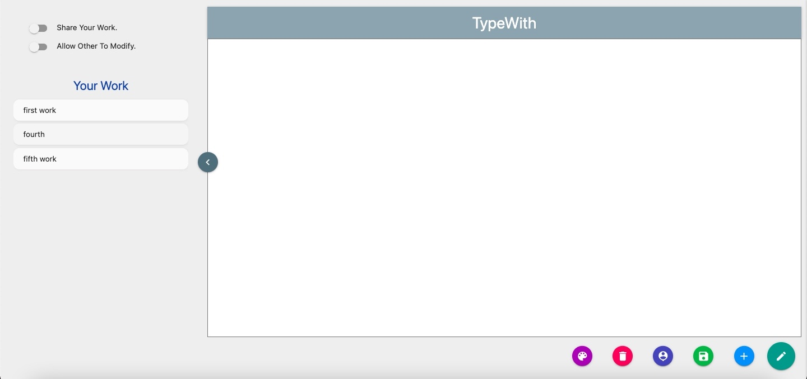
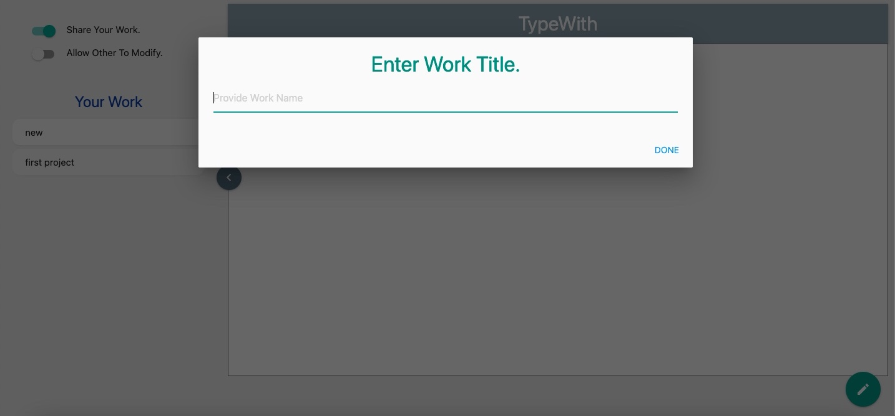
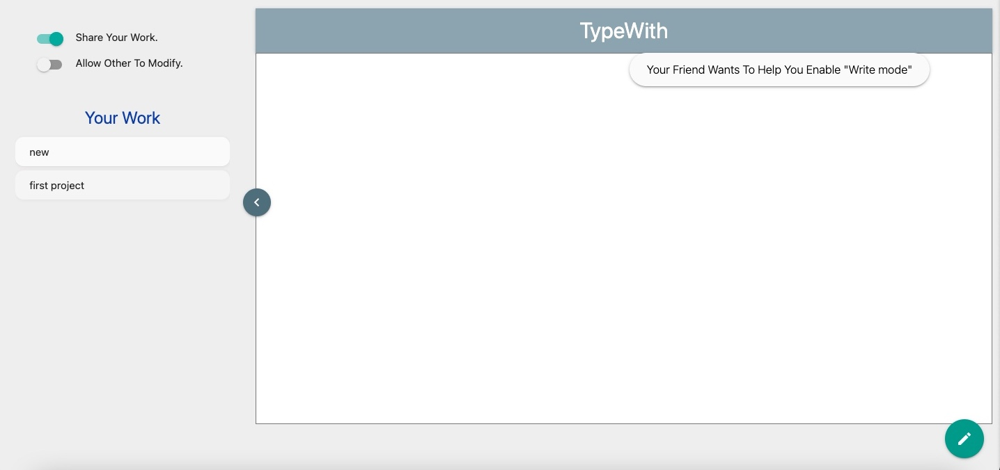
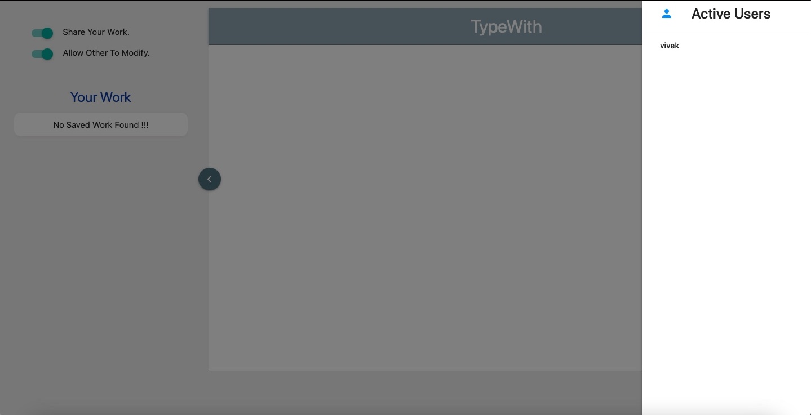
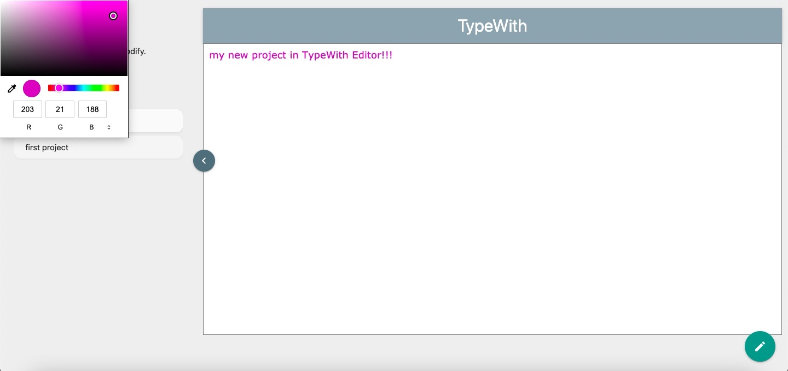
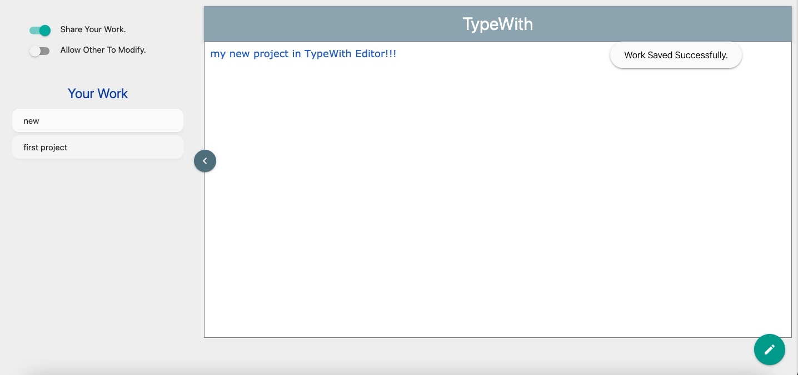

# TypeWith

TypeWith is a simple collaborative Text-Editor created using TypeScript and Websockets.

It will allow users to make a project/work easily and quickly with teams collaboration.

## Technologies -

- WebSocket
- TypeScript
- HTML
- SASS

## Features -

- Share Your Work.
- Allow Modification To Your Work.
- Save Your Work.
- Work On Multiple Projects.
- Delete Unwanted Works.
- Revisit Your Old Works.
- Complete Your Work With Different Colors.
- Get Info. About Active Participants.

## Setup And Installation -

```bash
  yarn
  yarn run dev
```

## ScreenShots -













## Demo -

Deployed on Netlify and Render - <a href="https://typewith.netlify.app" target="_blank">TypeWith</a>
